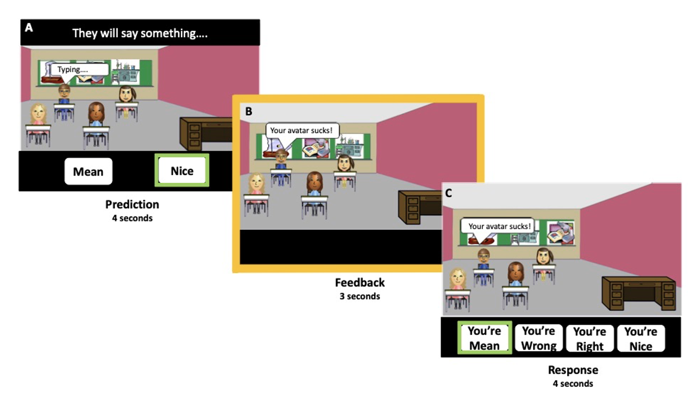

# RSA Hypothesis Comparison Generator  
*Social Developmental Neuroscience Lab – LEARN Task*  




## Overview  
This script generates a structured set of **hypothesis comparisons** for Representational Similarity Analysis (RSA) based on the **social learning fMRI (LEARN) task**.  
The goal is to systematically organize experimental condition contrasts that can later be used to test whether brain similarity patterns align with theoretical models of **valence, predictability, and negativity bias**.  

Output is saved as a CSV file (`rsa-hypothesis_comparisons.csv`) containing all defined comparisons, which can be directly integrated into analysis pipelines or manuscript figure/table generation.  

---

## Key Features  
- **Automated comparison building**: Conditions and families of comparisons are defined once and stored consistently in a DataFrame.  
- **Covers multiple conceptual families**: Within-peer, predictability-controlled, valence totals, predictability totals, and peer-level RSA models.  
- **Peer-level RSA expansion**: Includes explicit model-based RDMs (Disposition, Predictability, Negativity) with descriptions for alignment testing.  
- **Outputs to CSV** for reproducibility and downstream use.  

---

## Experimental Conditions  
The script encodes core conditions from the LEARN task:  

- **PN_N** – Nice feedback from Predictable Nice peer  
- **PN_M** – Mean feedback from Predictable Nice peer  
- **PM_N** – Nice feedback from Predictable Mean peer  
- **PM_M** – Mean feedback from Predictable Mean peer  
- **U_N** – Nice feedback from Unpredictable peer  
- **U_M** – Mean feedback from Unpredictable peer  

Aggregated totals are also included (e.g., total Nice vs. total Mean, predictable vs. unpredictable).  

---

## Concept Families of Comparisons  
1. **Within-Peer Valence**  
   - Tests differences in neural similarity between Nice vs. Mean feedback from the *same peer*.  

2. **Predictable Reputation (Valence-Controlled)**  
   - Compares feedback from *different peers* while holding valence constant (e.g., PN_N vs. PM_N).  

3. **Predictable Valence Totals**  
   - Collapses across peers to contrast total Nice vs. total Mean in predictable contexts.  

4. **Global Valence Totals**  
   - Collapses across all peers to contrast total Nice vs. total Mean feedback.  

5. **Global Predictability Totals**  
   - Compares total Predictable vs. total Unpredictable feedback.  

6. **Peer-Level RSA (Model Comparisons)**  
   - Brain RDM (peer-averaged similarity structure) vs. theoretical RDMs:  
     - **Disposition model** (groups peers by valence).  
     - **Predictability model** (groups peers by predictability).  
     - **Negativity model** (emphasizes separation of Mean peers).  

---

## Output Structure  
The final CSV includes the following columns:  

- **Concept family** – Conceptual category of the comparison  
- **Condition A / Condition B** – The two conditions being compared  
- **Comparison** – Human-readable description of the contrast  
- **SA vs. Non-SA** – Suggested group-level RSA alignment test (comparing Social Anxiety vs. Non-Social Anxiety participants)  

---

## Example Output (abridged)  

| Concept family                  | Condition A | Condition B | Comparison                          | SA vs. Non-SA |
|--------------------------------|-------------|-------------|-------------------------------------|---------------|
| Within-peer valence             | PN_N        | PN_M        | PN_N vs. PN_M                       | Compare pattern similarity ... |
| Predictable reputation (valence-controlled) | PN_N | PM_N | PN_N vs. PM_N | Compare pattern similarity ... |
| Global predictability totals    | Total Predictable | Total Unpredictable | Predictable vs. Unpredictable | Compare pattern similarity ... |
| Peer-level RSA                  | Brain RDM (4x4 peers) | Disposition model RDM | Brain vs. Disposition grouping | Alignment by SA vs. Non-SA |

---

## Usage  
Run the script with Python 3:  

```bash
python rsa_hypothesis_generator.py

