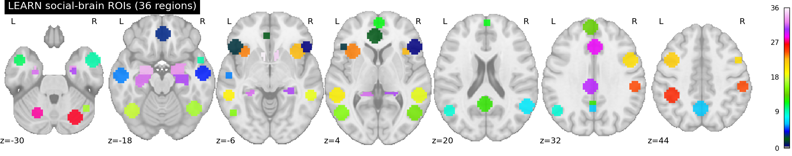

# LEARN social-brain ROIs

The 36 regions used in the LEARN RSA and inter-subject correlation analyses, packaged as a downloadable atlas. These are the exact regions the analyses read from, built on the same grid and in the same space as the betas, not a redrawn approximation.



## What is here

| File | What it is |
|------|------------|
| `LEARN_social_brain_ROIs.nii.gz` | One labeled volume. Every region is an integer from 1 to 36. This is the main file. |
| `LEARN_social_brain_ROIs.tsv` | The label table. One row per region: index, tag, name, hemisphere, category, MNI coordinate, voxel count, source. |
| `LEARN_social_brain_ROIs.json` | The same information plus a header block (space, grid, voxel size), machine readable. |
| `masks/` | 36 separate binary masks, one per region, named `NN-TAG.nii.gz`. Grab a single region without touching the rest. |
| `make_atlas.py` | The script that builds everything here, so the atlas is reproducible from its two sources. |
| `preview.png` | The montage above. |

## The regions

30 cortical regions are 10 mm spheres centered on the peak coordinates from the social-brain meta-analysis of Alcala-Lopez et al. (2018). 6 subcortical structures (hippocampus, amygdala, nucleus accumbens, each hemisphere) come from the Harvard-Oxford subcortical atlas at the 25 percent probability threshold. Every region is intersected with the LEARN group brain mask.

| # | Tag | Region | Hemi | MNI (x, y, z) | Voxels |
|---|-----|--------|------|---------------|--------|
| 1 | IFG_R | inferior frontal gyrus | R | 48, 24, 2 | 170 |
| 2 | IFG_L | inferior frontal gyrus | L | -45, 27, -3 | 171 |
| 3 | rACC | rostral ACC | mid | -3, 41, 4 | 171 |
| 4 | vmPFC | ventromedial PFC | mid | 2, 45, -15 | 171 |
| 5 | MTG_R | middle temporal gyrus | R | 56, -10, -17 | 171 |
| 6 | MTG_L | middle temporal gyrus | L | -56, -14, -13 | 171 |
| 7 | Prec | precuneus | mid | -1, -59, 41 | 171 |
| 8 | TPJ_R | temporoparietal junction | R | 54, -55, 20 | 168 |
| 9 | TPJ_L | temporoparietal junction | L | -49, -61, 27 | 171 |
| 10 | TP_R | temporal pole | R | 53, 7, -26 | 171 |
| 11 | TP_L | temporal pole | L | -48, 8, -36 | 133 |
| 12 | FP | medial frontal pole | mid | 1, 58, 10 | 171 |
| 13 | PCC | posterior cingulate | mid | -1, -54, 23 | 171 |
| 14 | dmPFC | dorsomedial PFC | mid | -4, 53, 31 | 171 |
| 15 | MT_V5_R | MT/V5 | R | 50, -66, 6 | 171 |
| 16 | MT_V5_L | MT/V5 | L | -50, -66, 5 | 171 |
| 17 | FG_R | fusiform gyrus | R | 43, -57, -19 | 171 |
| 18 | FG_L | fusiform gyrus | L | -42, -62, -16 | 171 |
| 19 | pSTS_R | posterior STS | R | 54, -39, 0 | 171 |
| 20 | pSTS_L | posterior STS | L | -56, -39, 2 | 171 |
| 21 | SMA_R | supplementary motor area | R | 48, 6, 35 | 171 |
| 22 | SMA_L | supplementary motor area | L | -41, 6, 45 | 171 |
| 23 | AI_R | anterior insula | R | 38, 18, -3 | 171 |
| 24 | AI_L | anterior insula | L | -34, 19, 0 | 171 |
| 25 | SMG_R | supramarginal gyrus | R | 54, -30, 38 | 171 |
| 26 | SMG_L | supramarginal gyrus | L | -41, -41, 42 | 171 |
| 27 | Cereb_R | cerebellum | R | 28, -70, -30 | 171 |
| 28 | Cereb_L | cerebellum | L | -21, -66, -35 | 171 |
| 29 | aMCC | anterior mid-cingulate | mid | 1, 25, 30 | 171 |
| 30 | pMCC | posterior mid-cingulate | mid | -3, -29, 32 | 171 |
| 31 | HC_R | hippocampus | R | 25, -19, -15 | 213 |
| 32 | HC_L | hippocampus | L | -24, -18, -17 | 215 |
| 33 | AM_R | amygdala | R | 23, -3, -18 | 107 |
| 34 | AM_L | amygdala | L | -21, -4, -18 | 89 |
| 35 | NAC_R | nucleus accumbens | R | 11, 10, -7 | 21 |
| 36 | NAC_L | nucleus accumbens | L | -13, 11, -8 | 21 |

Spheres hold 171 voxels when whole. A few are smaller because the sphere runs into the edge of the brain mask (TP_R, TPJ_R, IFG_R, and TP_L, which sits low in the temporal pole).

## Space and grid

- Space: MNI152 2009, the template the single-subject pipeline warped to.
- Grid: 64 x 76 x 64, 3 mm isotropic, taken from the LEARN group brain mask.
- The voxel counts in the table are from the per-region masks in `masks/`, which are the exact regions the analysis used. In the single labeled volume, the small number of voxels where two spheres overlap are assigned to the region whose center is nearest, so every voxel carries one label. If you need the regions exactly as analyzed, overlaps included, use the files in `masks/`.

## Load and view it

Python, with nibabel and nilearn:

```python
import numpy as np, nibabel as nib
from nilearn import plotting

atlas = nib.load("LEARN_social_brain_ROIs.nii.gz")
plotting.plot_roi(atlas)                 # quick look

data = np.asanyarray(atlas.dataobj)      # pull one region out by its index
racc = data == 3                         # rACC is label 3 (see the table)

single = nib.load("masks/03-rACC.nii.gz")  # or just load its own mask
```

FSL:

```bash
fsleyes $FSLDIR/data/standard/MNI152_T1_2mm.nii.gz \
        LEARN_social_brain_ROIs.nii.gz -cm random
```

AFNI:

```bash
3dROIstats -mask LEARN_social_brain_ROIs.nii.gz your_data+tlrc
```

## Rebuild it

```bash
python make_atlas.py
```

The script needs the two sources it was built from: the LEARN group brain mask (`LEARN_Grp90+tlrc`) and the Harvard-Oxford subcortical atlas that ships with FSL. Paths are set at the top of the script and can be overridden with the `GROUP_MASK` and `HO_PATH` environment variables. Running it reproduces the labeled atlas, the label tables, and all 36 masks.

## Cite

- Alcala-Lopez, D., et al. (2018). Computing the social brain connectome across systems and states. Cerebral Cortex, 28(7), 2207-2232.
- Harvard-Oxford subcortical atlas, distributed with FSL (Makris et al. 2006; Frazier et al. 2005; Desikan et al. 2006; Goldstein et al. 2007).

The cortical coordinates are from the Alcala-Lopez atlas. The subcortical masks are from Harvard-Oxford. This package regenerates them on the LEARN grid for reuse.
